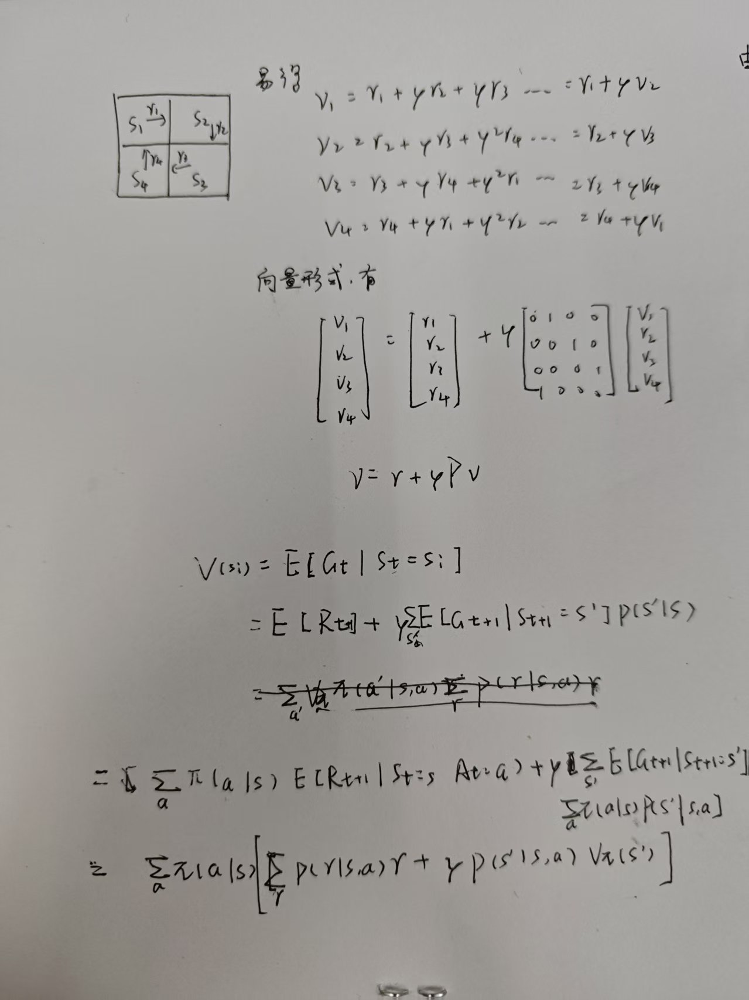
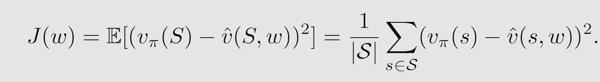

# 强化学习

define:

强化学习 是机器学习的一个分支，它关注的是智能体如何通过与环境进行交互，学习到一系列最优决策，以最大化其从环境中获得的累积奖励。

强化的几种基本模式有：

离线策略：用表现策略（运行时的策略）来进行探索，最后新生成一个最优策略。

在线策略：表现策略和目标策略是同一个，行为本身就会变成最优目标。

On\-policy：折中（边探索边学） 

Off\-policy：**分离探索和学习（更强大）**

## 马尔可夫过程（智能体行为）

define:

状态s                        当前环境中的状态,一般可离散化。

状态空间S：               所有可能状态的集合。

动作a                         一般是基于状态下的某种动作。会引起状态转移。

动作空间$A$                表示所有动作的集合。

状态转移，                  从一个状态转换到另外一个状态。

$s_1 \xrightarrow{a_2} s_2$

策略$\pi$，     在某种状态下采取某种**行为**的可能性。一个状态的策略指的是所有动作下采取的不同动作的可能性，而非单个动作的可能性。

$\pi\left(a_{1}\mid s_{1}\right)=p(a1|s1)$

回报r,      采取行动之后的打分。如果是正数奖励，如果是负数就是惩罚。

轨迹，      保存有动作，状态，回报的单向链表。

$S_{1}\xrightarrow[r=0]{a_{3}} S_{4}\xrightarrow[r=-1]{a_{3}} S_{7}\xrightarrow[r=0]{a_{2}} S_{8}\xrightarrow[r=+1]{a_{2}} S_{9} $

返回值G，   轨迹上回报的总和,经常以$\gamma$作为折扣因子抑制长链轨迹。

$G_{t} = R_{t+1} + \gamma R_{t+2} + \gamma^{2} R_{t+3} + \ldots$

如上是马尔可夫模型的基本抽象形式。

## 状态值公式（状态回报评估公式）

define:

描述了状态的评估以及状态之间如何进行转移的公式。一个状态的价值，等于你从该状态立即能获得的奖励，加上其后续状态价值的折扣平均值。如下给出了状态值，动作值以及贝尔曼期望公式的展开公式。

**状态值公式**

define:智能体从t时刻开始，如果系统处于状态si，未来累计回报Gt的期望值。注意，到达某状态的一瞬间，到达该状态的收益并不算到总收益里面。 而是计算从下一时刻开始的收益。

$v(s_i)=E[G_t|S_t =s_i]$

**短期收益与长期收益的和**

define:指定状态下指定策略的累计回报要考虑该状态下所有的动作的可能性。作为权重去乘以各自的当前收益以及未来状态的收益。

$V_{\pi}(s) = \sum_{a} \pi(a \mid s) \left[ \sum_{r} p(r \mid s, a) \cdot r + \gamma \sum_{s'} p(s' \mid s, a) \cdot V_{\pi}(s') \right]$

在一定条件下简化为，

$v =r+ \gamma Pv
$

r是不同的状态对应的回报值向量。

P描述了不同状态值之间的关联公式。

v状态值向量。

推导与证明:

通过以下推导可以得出结论，收益分为短期收益以及长期收益。

$G_{t} =R_{t}+\gamma{}G_{t+1}$

这里可以看到，策略执行本身是一种可能性，但是要考虑到策略执行有效的可能性。 

$E(G_{t+1}|S_t,S ^{,}_t+1)=E(G_{t+1}|S ^{,}_t+1)$

这里的p就是转移矩阵。

求解例子。

### **动作值公式**

define：
表示在s状态下采取a动作所能得到的收益。

$q_{\pi}(s, a) = \mathbb{E}\left[G_{t} \mid S_{t} = s, A_{t} = a\right]$

$v_{\pi}(s)=\sum_a{p(a|s)}q_{\pi}(a,s)$

这里的q是可能性，如果动作值确定了，而且动作采取的可能性确定了，那么状态值其实也就唯一确定了。

## 贝尔曼最优公式

define：

策略最优        当前策略下对$\forall{s}\in S$ 有  $\pi^*(s)>=\pi(s)$,则$\pi^*$ 策略最优。

$\max_{\pi}\sum_{a}\pi(a|s)q(a|s)=\max_{a}q(a|s)$

当：

$\pi (a|s) =\begin{cases}
1 &a =a^*   \\
0 &a \neq a^* 
\end{cases}$

其中：

$a^{*} =arg \max_{a}  q(s,a)$

简单来说，如果想获得最大的收益，就要把宝全部压在能产生最大的动作收益的动作上。

proof:

一般情况下，会优选动作值最大的赋予最高的策略权重，以实现最大收益。证明如下。

根据函论中的函数收缩定理。  最优策略存在唯一一个最优的状态值。并可以迭代求解。

## 值迭代与策略迭代

### 先算策略

第一步算出来最优策略。贪心算法计算出来最优策略。第二步是值的更新。根据当前策略的走法，通过值迭代把值更新到最好。循环执行1\-2步，简单来说，最优策略就是先找到使得当前收益最大的策略，然后再用策略来更新值。之后循环执行。

维护动作表以节省时间复杂度。

终止条件包含微分差别非常小。

### 先算值

使用迭代法把值更新到最好。再使用贪心算法计算出更好的策略。就是先算值，再更新策略。

## 蒙特卡洛算法（无模型估计思想）

是一个无模型优化算法。

### mc basic

蒙特卡洛是一种无模型的方法，通过多次平均收益来逼近真实值，但是需要一整局，也就是最终能够结束，才能行之有效的统计真实的收益。

就拿动作值来说，蒙特卡洛会估计t时刻的动作值，但是估计这个动作值是后面所有的收益加起来算出来的，是后面的向t\+1时刻累加。

这里的计算特别适合反向迭代。 

适用蒙特卡洛来估计期望。

核心思想是从动作值公式的原理出发，用大数定理估计去近似这个值。这个公式很美，这说明了基于函论的算法和基于概论的最基本区别，就是有无明确数学关系，有的话称之为模型，没有的话称之为经验。

也就是说，大力出奇迹，一个状态下能取得的值可以通过大量的尝试去近似出来。

### 充分利用轮数的算法

每一轮实际上都是预测动作之后的收益，那么如果一轮训练中，每一个动作都产生一个估计的话，那么会大幅度降低估计复杂度。实际上这是更合理的，我们在执行一条轨迹的时候，任何的状态和动作其实都会作为经验进行学习。在执行轨迹的过程中也有可能动态调整。

同时我们做完一轮之后立马去估计并更新策略。

但是这样带来一个问题，如果我们从某个点开始学习，随着最优迭代的进行，会导致有些点被忽略。为了在模拟的过程中遍历其它可能以不忽略最优解，所以引入了软策略。 

这里可以对应mbti的p值。对应p值越大，探索欲越强，越是p。但是p带来探索性的同时，又牺牲了最优性。   

## 随机附近与随机梯度下降\(无模型迭代\)

### 迭代公式推导

随机近似理论

define:

最大似然估计指出，随机事件的无穷极限等于事件出现的概率 。其中通过迭代公式可以将公式进行转换。

### 随机逼近（观测值迭代）

这里不一样的地方是，可以把其中的$\alpha_{k}$替换掉$1\\k$。得到如下的通式。关于如何构建这个公式，首先一个就是我们知道w表示一个函数关系，我只关系输入变量，也就是与什么有关，所以就能列出来如下的一个式子。这里强调观测值函数，也就是说，我无需将这个观测值中的噪声算出来。但是他客观存在，且作为一个变量输入。

通过证明，发现这个函数公式会终将趋近于0点，如下是证明过程。当然这个g函数需要很多前置条件。

条件 1  步长的和趋向于无穷大。

条件 2ak数组。  平方小于无穷指的是后面这个系数会逐渐趋向于0。所以不可能等于无穷，一定有比他大的。和等于无穷是为了确保我的$w^{*}$可以无限选择。

条件3：    函数的曲率不能太快

很自然的，我们可以使用1/k来进行代替ak。满足条件。

### 梯度下降方法总结

这是机器学习、深度学习中最核心的优化算法之一，用于在训练模型时，通过“随机”选取少量样本（一个或一批）计算梯度来更新模型参数，从而高效地找到最小化损失函数的参数值。与传统的“批量梯度下降”相比，它的计算效率更高，是训练大规模神经网络的关键技术。

方法3有个很明显的缺点，就是采样是有误差的。

接下来分析这个相对误差。满足距离越大，相对误差越小。距离近相对误差就开始大起来了。

同时，方法2和方法3之间可以采取折中策略。

计算举例。

## 时序差分方法

这里利用到将概率公式转化为迭代求解式。这个迭代式涉及到观测值和观测函数，所以我们的期望也是逐步更新的，所以涉及到迭代的期望值。最终转换链路如下。

这里的求解利用了将解方程问题转换为求函数零点问题。把“关系”“条件”“约束”转化为函数，这是一种函数化思想。

同时利用了观测值函数，观测值函数的定义是未知数与观测值有关的函数。

时序差分的前置条件是，默认状态不处于离散点的时候，是不进行更新的。

这个公式的含义是，我要进行预测，也就是想算出来下一时刻的当前状态的价值，那么我就需要结合现在的值，同时根据新拿到的值进行修正。

这里给出了目标分析和误差分析。首先确定是向着目标前进，接着是说明误差趋向于0了。

贝尔曼期望公式是求策略下的状态值。

这个公式就是时序差分学习更新公式，他的特点是，只学一步未来。

性质

### sarsa算法

这个公式套上策略迭代

变式1，sars

### q\_learning  

q learn相比于sarsa方法，总是去追求理想的最优解。

为什么说q\_learn 是离线策略，因为它的迭代是不依赖策略的更新的。

q\_learn 在其中求解的是贝尔曼最优公式。

## 值函数近似

使用值函数近似的原因，是因为如果参数的输入太多，会导致难以保存价值函数（比如状态值函数），这个时候可以用参数化的函数近似，这个参考泰勒公式，这种近似思想。

值函数近似的方法就是用函数代替表，用梯度下降学习价值。

这里的$\theta$就是参数，常常用来表示权重。

这里引入值函数：

值函数就是用函数的形式去代替原来的表，用参数化的形式来实现近似逼近真实的值。

1\.这个值函数里面的s是随机变量，

这里的$\omega$就是待修正的权重，其中函数往往代表特征值。

构造目标函数。通过构建优化目标，不断的通过含有s的观测进行优化w，最终获取最优的值

一般情况下，考虑迭代的时候，要赋予不同的数据以不同的权重。

由于上面说到值函数中这些地方是随机变量，由于随机变量是有分布的，所以这里可以做合理假设，有时候可以假设这个地方是平均分布

由于实际上往往不是平均分的，所以提出进一步优化

我们假设存在一个和为1的概率分布，这里的概率是一种迭代优化的，表现出来这个状态的重要性权重的参数。

通过观测会发现某些状态在指定策略下会逐渐倾向于稳定，这里联想到概率，通过概率来去确定上面公式的最优化权重。由于状态转移方程是指定策略下的稳态值，进而也就计算出来了目标权重对应的值

具体如何找到这个分布，这里借用了状态转移矩阵。

根据梯度下降算法，我们很自然的想到

其中$\hat{v}(s,t)=\phi^{T}(s)\omega$,这里是一种特征向量，可以是傅里叶，多项式形式的。

那么就会有

$\nabla_{\omega} \hat{v}(s,t)=\phi(s)$

因此，会有

$\omega_{t+1}=\omega_{t}+\alpha_{t}(r_{t+1}+\gamma\phi(s_{t+1})\omega_{t}-\phi^{T}(s_{t})\omega_{t})\phi{s_{t}}$

这个方法的优势在于需要你具备很强的直觉，确定采用什么类型的函数，好处是理论性质可以被很好的分析。

像这种问题，可以构造具体的td\_liner

同时可以把多次项加进来。

很明显，参数比较多的时候，线性函数逼近的效果会更好，这里提一句，为什么要使用神经网络，是因为神经网络的话，它可以拟合任何意义上的非线性函数。

另外一种就是现在比较常用的，基于神经网络去做一个近似。神经网络可以近似为一个$\omega$作为可以调节的参数，s作为输入的一个隐式的一个网络，其中输出直接就是$\hat{v}(s,t)$

值函数近似下的sarsa算法。

接下来介绍一下dql

先介绍一下q\_learing 的值函数近似

其中deep\_q\_learning扮演的角色是一个黑盒。

这里引入了dqn算法

### DQN

先看一下dqn的最优目标函数

这里面有两个网络需要维护，其中目标网络更新频率慢于主网络，如下。

经验回放

## 策略梯度方法

这里优化策略函数

这里主要需要的是梯度上升的方法。

这里是状态总值评估

评估的时候确定d的分布

把$r_{\pi}$专门列了一下

这里说明，不管是对回报做评估还是对策略值做评估，都是等效的。

简单认识，不做证明

策略梯度的公式进行总结，有

带到梯度表达式中

### reinforce

给出了策略梯度更新的方法

然而没有跟$\pi$解耦，这里可以用一些即时采样的方法。

这里提到，s与d，a与pi是遵从分布的，这是可以采样的

## actor\_critic方法

## PPO算法

### 公式推导

轨迹期望目标

↓

对概率求导

↓

log trick

↓

展开轨迹概率

↓

变成 ∑ log π

↓

引入 G\_t（时间分解）

↓

引入 Advantage（降方差）

↓

重要性采样（r\_t）

↓

PPO clip（稳定更新）

