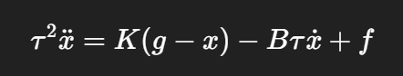

# 结合语义约束与几何约束的观察学习

思路：

需要学习出示教轨迹中的自由运动与约束运动的运动参数，就需要多组数据。

基于dmp进行数据扩充，然后用碰撞检测把不可以的剔除掉。

使用任务参数化高斯混合模型学习扩充后的数据集，学习到轨迹中存在的任务特征参数。

通过高斯混 合回归方法 GMR 利用学习到的任务特征参数对轨迹进行泛化，生成改变位置后 物体轨迹。

生成dmp之后，可以把轨迹泛化成很多。然后可以通过高斯混合模型继续泛化，最后gmr模型拟合。

## DMP

DMP （Dynamic Movement Primitive，动态运动基元）本质上是一个**用动力系统来表示轨迹**的方法。

这里使用了一个二阶系统去模拟了逆动力学。

基于基本的公式

可以将演示轨迹进行学习，然后尝试使用dmp进行表示。

$τ2x¨d+Bτx˙d+K(xd−g)=ftarget$

把示教轨迹当作系统输出时，需要的总驱动力

这里的离散化默认是时变量，所以没有泛化能力，引入

$τs˙=−αs$

有，（这里用rbf拟合3）

然后我就可以通过把f的自变量变为一个可以进行时间放缩的值。这样就实现了时间尺度上的缩放。

具体流程为：利用动作捕捉设 备采集人体运动数据，通过示范学习完成参数拟合，离线建立 DMP 模型，随后 基于训练好的 DMP 在线推算目标路径，借助逆向运动学求解关节角度指令，传 输至机械臂位控系统实现轨迹跟随。

也就是说，DMP是离线生成的。

这里

**非线性建模能力**：高斯函数是非常强的非线性拟合工具。

### 调参

1️⃣ 动力学参数（决定稳定性/手感）

K, B

2️⃣ 时间参数（决定快慢）

τ, α\_s

3️⃣ 表达能力参数（决定拟合能力）

N（基函数数）

c\_i, σ\_i

w\_i（学习得到）

K = 100 \~ 1000

B = 2√K

### 

## GMM 高斯混合模型

### DTW时间对齐

用动态时间规整（DTW）技术对原始示教数据进行时序对齐处理。

### GMM轨迹泛化

通过前面的dmp动作的泛化，可以生成多个轨迹，然后通过时间对齐，生成了多个时间对齐的轨迹。

随后通 过 GMM 算法建立示教数据的概率分布模型,GMM就是用若干个局部高斯去拟合样本轨迹的状态分布，每个高斯的均值和协方差描述轨迹在该局部空间的统计特性，高斯分布就是利用多个高斯函数，通过调节参数，估计一个点在一个时间出现在一个位置的置信度。

计算方法为：

针对单一高斯分布模型，其参数估计可直接采用极大似然估计方法获得解析 解。然而，在混合高斯模型场景下，由于各观测点的潜在类别归属未知，需要采 用迭代优化策略进行求解。

K

#### K\-Means 轨迹初始化

K\-Means 算 法的核心假设是：样本间的距离越小则相似性越高。

这个算法的核心是随机采样几个质心点，然后将周围的点按照距离收纳进其质心所在的集合中，然后重新计算质心并不断迭代。

在模型训练过程中，需要交替执行期望步骤和最大化步骤直至满足收敛条件

K\-means 在 GMM 参数初始化中，帮助每个高斯找到合理的均值和协方差，使 EM 收敛更快、更稳定，同时每个高斯对应轨迹的局部模式。

### TP\-GMM

其核心在于处理多坐标 系与多观测数据集间的耦合关系。

考虑到任务执行过程中参考系间的相对位姿可 能发生动态变化，通过对坐标系间关联特性的参数化编码，可实现起始点与目标 点位置变化时的轨迹自适应生成能力。  

### 高斯混合回归，GMR

> 高斯过程回归是一种 **非参数回归方法**，它通过**定义函数值的联合高斯分布**来进行预测。
> 
> **任意有限个输入点的函数值联合起来，服从一个多元高斯分布**。
> 
> 

最终利用 GMR 方法实现任务轨迹 的回归预测。

通过估计各混合成分的分布特性，可生成平滑且连续的运动轨迹。

基于高斯混合模型完成轨迹分布建模后，由于任务边界存在不确定性，需进 一步采用高斯混合回归进行概率化轨迹优化。该回归方法通过概率密度加权的方 式，对目标空间位置进行最优估计。

与gmm的区别

训练

